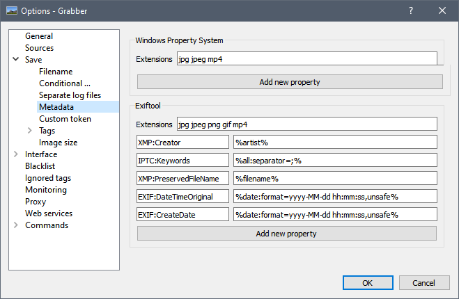

# Introduction

You might want to store a post's information not in the downloaded file's filename, but instead inside its metadata. This usually allows better searching, and avoid filesystem filename length limits.

# Windows Property System

Only available on Windows due to the nature of those properties.

Only available on a few extensions by default (JPG / MP4, not PNG / GIF / WEBM). If you want this to work on every extension, you should use something like [FileMeta](https://github.com/Dijji/FileMeta).

Example of commonly used property names (non-exhaustive):
* System.Author
* System.Keywords
* System.Comment

The full list can be found here:  
<https://docs.microsoft.com/en-us/windows/win32/properties/props>

Here's a basic example of what is possible to do:

# Exiftool

You first need to download Exiftool and put it in a place where Grabber can find it. Either in your PATH or in the installation folder.

Only available on extensions supported by Exiftool. Note that even with this name, Exiftool does not only support EXIF, but also IPTC, XMP, and ICC, as well as some others format-dependent options.

Example of commonly used property names (non-exhaustive):
* IPTC.Keywords
* XMP.Creator

The full list can be found here:  
<https://exiftool.org/#supported>

Note that you don't necessarily need to put the IPTC/XMP prefix, as Exiftool will find it automatically (checking in this order: EXIF, IPTC, XMP).

Here's a basic example of what is possible to do:

